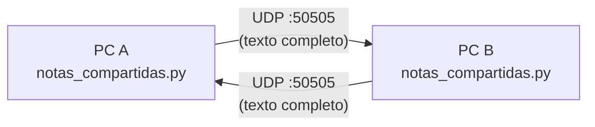

# Diseño — Notas compartidas LAN

Documentación del proyecto **Notas compartidas LAN**: comunicación instantánea de texto entre 2 PCs de la misma red local.

## Arquitectura
Arquitectura simétrica peer-to-peer: el mismo programa corre en las dos PCs. Cada instancia:
- Escucha datagramas UDP entrantes en un puerto fijo (`MI_PUERTO`).
- Envía el contenido de su caja de texto a la IP y puerto de la otra PC (`IP_OTRA_PC`, `PUERTO_OTRA_PC`) cada vez que el contenido cambia.

No hay servidor central ni un tercer proceso involucrado: es una conexión directa entre las dos máquinas.

## Diagrama

## Flujos

### Flujo de envío (al tipear o pegar)
1. El widget de texto (`ScrolledText`) dispara el evento `<KeyRelease>` (tecla normal o Ctrl+V).
2. `enviar()` lee el contenido completo de la caja (`caja.get("1.0", "end-1c")`).
3. Se codifica en UTF-8 y se manda por `sock.sendto()` a `IP_OTRA_PC:PUERTO_OTRA_PC`.

### Flujo de recepción
1. Un hilo daemon (`hilo`) corre `escuchar()` en loop, bloqueado en `sock.recvfrom()`.
2. Al llegar un datagrama, se decodifica (UTF-8, con reemplazo de bytes inválidos).
3. Como tkinter no es *thread-safe*, la actualización de la interfaz no se hace directo desde el hilo: se agenda con `ventana.after(0, actualizar_caja, texto)` para que corra en el hilo principal.
4. `actualizar_caja()` borra el contenido actual de la caja y pone el texto recibido.

## Decisiones de diseño relevantes
- **Reemplazo total, no edición incremental**: cada mensaje manda el texto completo, no solo lo que cambió. Más simple de razonar, a costa de más datos por paquete (sin problema en LAN para textos cortos/medianos).
- **Sin cola de mensajes ni historial**: cada texto nuevo sobrescribe al anterior en pantalla. No hay registro de mensajes previos.
- **Límite práctico de tamaño**: un datagrama UDP tiene un límite práctico de unos 65 KB, y en redes reales puede fragmentarse por encima de ~1472 bytes (MTU típica). Para notas de texto normales no es un problema; para pegar documentos muy largos podría fallar. Sin manejo especial todavía (ver `05-Checklist.md`).
