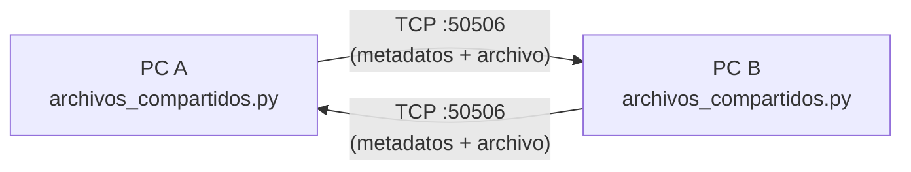

# Diseño — Compartir archivos LAN

Documentación del componente **Compartir archivos LAN**: transferencia de archivos entre 2 PCs de la misma red local.

## Arquitectura
Arquitectura simétrica peer-to-peer: el mismo programa corre en las dos PCs. Cada instancia:
- Escucha conexiones TCP entrantes en un puerto fijo (`MI_PUERTO`).
- Puede iniciar conexiones TCP salientes a la otra PC (`IP_OTRA_PC`, `PUERTO_OTRA_PC`) para enviar archivos.
- Maneja transferencias simultáneas como emisor y receptor (en hilos separados).

No hay servidor central ni un tercer proceso involucrado: es una conexión directa entre las dos máquinas.

## Diagrama



## Protocolo de Transferencia

### Formato de mensaje
Cada transferencia sigue este protocolo simple:

1. **Fase de metadatos** (emisor → receptor):
   - Longitud del nombre del archivo (4 bytes, big-endian, entero)
   - Nombre del archivo (UTF-8, sin null terminator)
   - Tamaño del archivo (8 bytes, big-endian, entero)
   
2. **Fase de contenido** (emisor → receptor):
   - Bytes del archivo en chunks de tamaño fijo (4096 bytes por defecto)
   - El receptor lee exactamente `tamaño_archivo` bytes

### Ejemplo de flujo
```
Emisor                          Receptor
   |                                |
   |--- [4 bytes: longitud nombre] ->|
   |--- [nombre archivo] ----------->|
   |--- [8 bytes: tamaño archivo] -->|
   |                                | (valida que tiene espacio)
   |--- [chunk 1: 4096 bytes] ------>|
   |--- [chunk 2: 4096 bytes] ------>|
   |--- ... ------------------------>|
   |--- [chunk N: < 4096 bytes] ---->|
   |                                | (cierra archivo, confirma)
```

## Flujos

### Flujo de envío (al seleccionar archivo)
1. Usuario hace clic en botón "Seleccionar archivo" y elige archivo del sistema.
2. `seleccionar_archivo()` abre `filedialog.askopenfilename()` y obtiene ruta.
3. `iniciar_envio()` abre conexión TCP a `IP_OTRA_PC:PUERTO_OTRA_PC`.
4. Envía metadatos (longitud nombre, nombre, tamaño).
5. Lee archivo en chunks de 4096 bytes y envía cada chunk.
6. Actualiza barra de progreso después de cada chunk.
7. Cierra conexión y muestra mensaje de éxito.

### Flujo de recepción
1. Hilo daemon (`hilo_servidor`) corre `aceptar_conexiones()` en loop.
2. `accept()` bloquea hasta que llega una conexión entrante.
3. Se crea un nuevo hilo para manejar esa conexión específica (`manejar_cliente()`).
4. `manejar_cliente()` lee metadatos (longitud nombre, nombre, tamaño).
5. Crea archivo en carpeta de descargas con el nombre recibido.
6. Lee chunks en loop hasta recibir exactamente `tamaño_archivo` bytes.
7. Escribe cada chunk al archivo y actualiza progreso.
8. Cierra archivo y conexión, muestra mensaje de éxito.

### Flujo de actualización de interfaz
- Como tkinter no es thread-safe, las actualizaciones de UI (barra de progreso, mensajes) se hacen vía `ventana.after(0, funcion, args)`.
- El hilo principal solo maneja eventos de usuario; los hilos de red solo hacen I/O y agendan actualizaciones.

## Decisiones de diseño relevantes
- **TCP en lugar de UDP**: garantiza entrega y orden; manejo de flujo automático; ideal para archivos.
- **Protocolo simple pero estructurado**: metadatos primero para que el receptor sepa qué esperar; permite validación antes de recibir contenido.
- **Chunking**: lectura/envío en bloques fijos (4096 bytes) para no cargar archivos grandes en memoria y permitir actualización de progreso.
- **Hilos separados por conexión**: cada transferencia entrante tiene su propio hilo, permitiendo múltiples recepciones simultáneas (aunque inicialmente se limitará a una a la vez).
- **Carpeta de descargas configurable`: por defecto `descargas/` junto al script, pero puede cambiarse en constantes.
- **Sobrescritura**: si existe archivo con mismo nombre, se agregará timestamp (ej: `archivo_20260710_120534.txt`) para evitar pérdida de datos.
- **Transferencia uno-a-uno**: mientras se envía un archivo, no se puede iniciar otro envío; mientras se recibe un archivo, nuevas conexiones se rechazan temporalmente.
