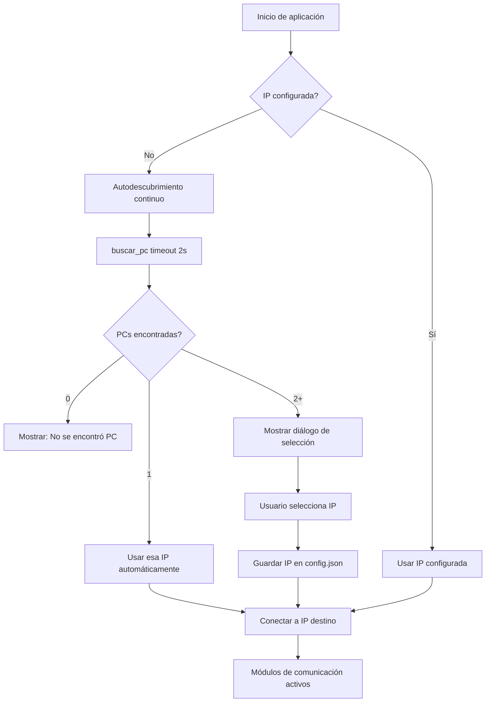

# Diseño — Multi-PC Soporte

Documentación del componente **Multi-PC Soporte**: soporte para más de 2 PCs en la red con selección manual de destino.

## Arquitectura
Mantiene la arquitectura existente de comunicación 1-a-1. Agrega una capa de selección de destino que se activa condicionalmente cuando hay más de 2 PCs en la red.

### Cambios en el Flujo de Descubrimiento

**Flujo actual (2 PCs):**
1. `buscar_pc()` encuentra todas las PCs
2. Usa automáticamente la primera IP encontrada (`encontradas[0]`)
3. Guarda en `config.json`

**Nuevo flujo (3+ PCs):**
1. `buscar_pc()` encuentra todas las PCs
2. Si `len(encontradas) > 1`, mostrar diálogo de selección
3. Usuario selecciona IP destino
4. Guarda en `config.json`
5. Si `len(encontradas) == 1`, comportamiento idéntico al actual

## Diagrama de Flujo de Selección



## Interfaz de Usuario

### Diálogo de Selección de PC
- **Tipo:** `simpledialog` o `Toplevel` con `Listbox`
- **Contenido:** Lista de IPs encontradas
- **Opcional:** Intentar obtener nombre de host para cada IP (usar `socket.gethostbyaddr()`)
- **Comportamiento:**
  - Si falla `gethostbyaddr()`, mostrar solo IP
  - Si tiene éxito, mostrar "IP (nombre)"
  - Permitir cancelar (en ese caso, no conectar)

### Botón de Cambio de Destino
- **Ubicación:** Barra inferior, junto a "Buscar PC" y "IP manual"
- **Texto:** "Cambiar destino"
- **Comportamiento:**
  - Ejecuta `buscar_pc()` con timeout mayor (4s)
  - Muestra diálogo de selección con PCs disponibles
  - Si usuario selecciona, actualiza `IP_OTRA_PC` y guarda en `config.json`
  - Actualiza etiquetas de estado

## Modificaciones al Código Existente

### Función `autodescubrir_continuo()`
**Actual:**
```python
if encontradas:
    ventana.after(0, lambda: aplicar_ip(encontradas[0]))
```

**Nuevo:**
```python
if len(encontradas) == 1:
    ventana.after(0, lambda: aplicar_ip(encontradas[0]))
elif len(encontradas) > 1:
    ventana.after(0, lambda: mostrar_dialogo_seleccion(encontradas))
```

### Nueva Función `mostrar_dialogo_seleccion(ips)`
```python
def mostrar_dialogo_seleccion(ips):
    """Muestra diálogo para seleccionar PC destino cuando hay múltiples."""
    dialogo = tk.Toplevel(ventana)
    dialogo.title("Seleccionar PC destino")
    dialogo.geometry("300x250")
    
    lbl = tk.Label(dialogo, text="Seleccione la PC destino:")
    lbl.pack(pady=10)
    
    lista = tk.Listbox(dialogo)
    lista.pack(fill="both", expand=True, padx=10, pady=5)
    
    for ip in ips:
        try:
            nombre = socket.gethostbyaddr(ip)[0]
            lista.insert(tk.END, f"{ip} ({nombre})")
        except:
            lista.insert(tk.END, ip)
    
    def seleccionar():
        seleccion = lista.curselection()
        if seleccion:
            ip_seleccionada = ips[seleccion[0]]
            aplicar_ip(ip_seleccionada)
            dialogo.destroy()
    
    btn = tk.Button(dialogo, text="Seleccionar", command=seleccionar)
    btn.pack(pady=10)
```

### Nueva Función `cambiar_destino()`
```python
def cambiar_destino():
    """Permite cambiar el destino en cualquier momento."""
    encontradas = buscar_pc(timeout=4)
    if not encontradas:
        mostrar_mensaje("No se encontraron PCs en la red")
        return
    if len(encontradas) == 1:
        aplicar_ip(encontradas[0])
        mostrar_mensaje(f"Conectado a {encontradas[0]}")
    else:
        mostrar_dialogo_seleccion(encontradas)
```

### Modificación a la Barra Inferior
Agregar botón:
```python
btn_cambiar = tk.Button(frame_barra, text="Cambiar destino", command=cambiar_destino, padx=8)
btn_cambiar.pack(side=tk.LEFT, padx=(0, 6))
```

## Decisiones de Diseño

1. **Diálogo condicional:** Solo mostrar diálogo cuando hay más de 2 PCs. Con 1 o 2, comportamiento transparente.

2. **Nombres de host opcionales:** Intentar obtener nombre de host, pero no fallar si no es posible. Mostrar IP como fallback.

3. **Botón de cambio siempre visible:** Permitir cambiar destino en cualquier momento, incluso si solo hay 2 PCs (útil si una se desconecta y aparece otra).

4. **Timeout mayor para cambio manual:** Cuando el usuario hace clic en "Cambiar destino", usar timeout de 4s en lugar de 2s para dar más tiempo al descubrimiento.

5. **Validación antes de conectar:** El diálogo solo muestra PCs que respondieron al descubrimiento, garantizando que estén online.

6. **Mantener config.json:** La IP seleccionada se guarda igual que antes, sin cambios en el formato.

7. **Thread-safety:** El diálogo se crea desde el hilo principal (vía `ventana.after`), no desde hilos de red.

## Casos Borde

### PC se desconecta después de selección
- Si la PC seleccionada se desconecta, el usuario puede hacer clic en "Cambiar destino" para seleccionar otra.
- No hay reconexión automática (fuera de alcance).

### Nueva PC aparece en la red
- El usuario debe hacer clic en "Cambiar destino" para ver la nueva PC.
- No hay notificación automática de nuevas PCs (fuera de alcance).

### Todas las PCs offline
- `buscar_pc()` retorna lista vacía
- Mostrar mensaje "No se encontraron PCs en la red"
- Usuario puede reintentar más tarde

### Solo esta PC en la red
- `buscar_pc()` retorna lista vacía (se filtra IP propia)
- Mostrar mensaje "No se encontraron PCs en la red"
- Comportamiento idéntico al caso de todas offline
