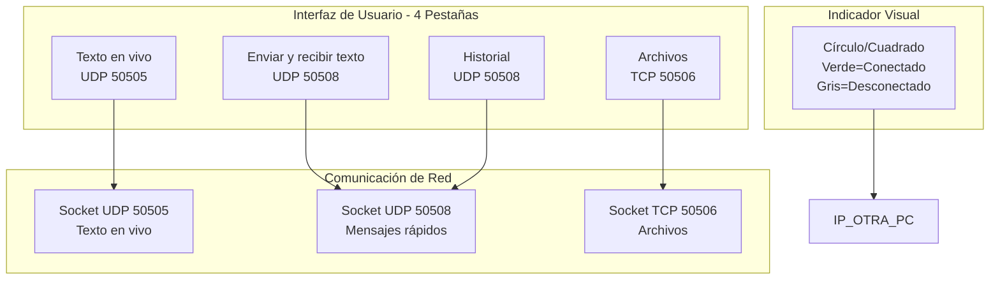

# Diseño - Mejoras UI 4 Pestañas

## Arquitectura general
Se modifica `notas_compartidas.py` para tener 4 pestañas en un `ttk.Notebook`:
1. Texto en vivo (existente, mejoras UI)
2. Enviar y recibir texto (nuevo)
3. Archivos (existente, sin cambios)
4. Historial (nuevo)

## Diagrama de arquitectura

## Diseño de pestañas

### Pestaña 1: Texto en vivo
- **Layout:** ScrolledText que ocupa todo el espacio
- **Funcionalidad:** Edición en tiempo real (sin cambios)
- **Cambios:**
  - Remover mensajes de "[PC encontrada: IP]" del área de texto
  - Agregar indicador visual de conexión en barra inferior

### Pestaña 2: Enviar y recibir texto
- **Layout:**
  - Arriba: Frame con ScrolledText (input) + Button "Enviar"
  - Debajo: Frame con ScrolledText (recepción) + Button "Copiar"
- **Funcionalidad:**
  - Input: Área para escribir mensaje
  - Botón Enviar: Envía mensaje, limpia input, agrega al historial
  - Área recepción: Muestra mensajes recibidos
  - Botón Copiar: Copia al clipboard, limpia área

### Pestaña 3: Archivos
- **Layout:** Sin cambios (existente)
- **Funcionalidad:** Sin cambios (existente)

### Pestaña 4: Historial
- **Layout:** ScrolledText con scroll vertical
- **Funcionalidad:**
  - Muestra todos los mensajes enviados/recibidos
  - Formato: `[HH:MM:SS] Mensaje`
  - Más nuevo arriba
  - Sincronizado con la otra PC

## Flujo de datos

### Envío de mensaje rápido
1. Usuario escribe en input
2. Presiona "Enviar"
3. Se genera timestamp
4. Se envía por UDP 50508: `timestamp|||mensaje`
5. Input se limpia
6. Mensaje se agrega al historial local

### Recepción de mensaje rápido
1. Socket UDP 50508 recibe datagrama
2. Se parsea: `timestamp|||mensaje`
3. Se muestra en área de recepción
4. Se agrega al historial local

### Copiar mensaje
1. Usuario presiona "Copiar"
2. Contenido de área de recepción se copia al clipboard
3. Área de recepción se limpia

## Indicador visual de conexión
- **Implementación:** Canvas con `create_oval` o `create_rectangle`
- **Colores:**
  - Verde: `#00FF00` o `#4CAF50`
  - Gris: `#CCCCCC`
- **Ubicación:** Barra inferior, entre botones y etiqueta de estado
- **Actualización:** Se actualiza cuando cambia `IP_OTRA_PC`
