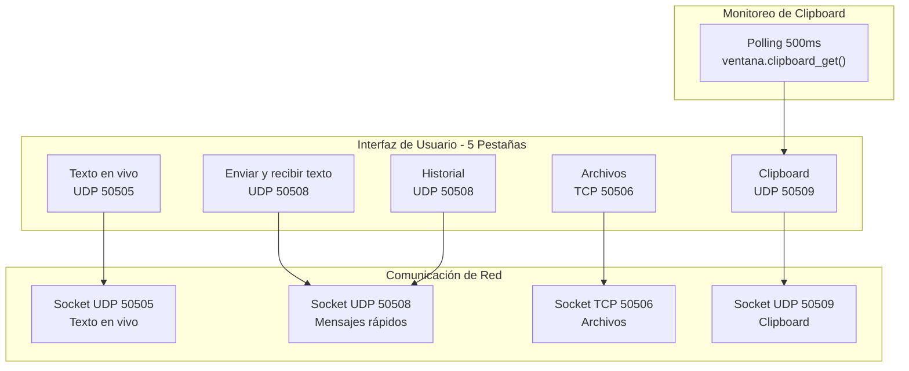

# Diseño - Historial de Clipboard

## Arquitectura general
Se modifica `notas_compartidas.py` para tener 5 pestañas en un `ttk.Notebook`:
1. Texto en vivo (existente)
2. Enviar y recibir texto (existente)
3. Archivos (existente)
4. Historial (existente)
5. Clipboard (nuevo)

## Diagrama de arquitectura

## Diseño de pestaña "Clipboard"

### Layout
- ScrolledText que ocupa todo el espacio
- Historial de copias con timestamp
- Más nuevo arriba

### Funcionalidad
- Monitoreo automático del clipboard del sistema (polling cada 500ms)
- Detección de cambios en el clipboard
- Guardado de nuevos contenidos con timestamp
- Sincronización con la otra PC
- Formato: `[HH:MM:SS] contenido_copiado`

## Flujo de datos

### Monitoreo de clipboard local
1. Hilo de monitoreo verifica clipboard cada 500ms
2. Compara contenido actual con contenido anterior
3. Si hay cambio:
   - Genera timestamp
   - Agrega al historial local
   - Envía por UDP 50509: `timestamp|||contenido`
   - Actualiza contenido anterior

### Recepción de clipboard remoto
1. Socket UDP 50509 recibe datagrama
2. Parsea: `timestamp|||contenido`
3. Agrega al historial local
4. No modifica el clipboard local (para evitar loop infinito)

## Consideraciones de diseño
- **Polling interval:** 500ms (balance entre responsividad y performance)
- **Deduplicación:** No guardar duplicados consecutivos
- **Límite de historial:** Considerar límite de 100-200 entradas para evitar memoria excesiva
- **Privacidad:** El usuario debe ser consciente de que el clipboard se sincroniza
