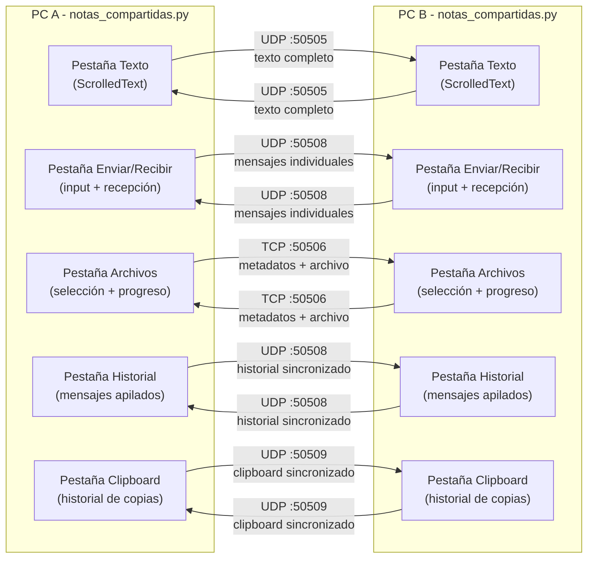
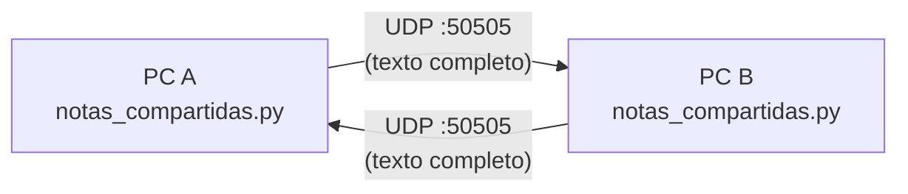

# Documento de Diseño — Actual

## Arquitectura General
App unificada en `notas_compartidas.py` con 5 pestañas (ttk.Notebook). Arquitectura simétrica peer-to-peer: el mismo programa corre en las dos PCs. Cada instancia ejecuta simultáneamente:

- **Módulo Texto** (UDP :50505): escucha y envía texto en vivo
- **Módulo Mensajes Rápidos** (UDP :50508): envío/recepción de mensajes individuales + historial
- **Módulo Clipboard** (UDP :50509): monitoreo de clipboard + sincronización de historial
- **Módulo Archivos** (TCP :50506): servidor de recepción + cliente de envío

## Diagrama General

## Interfaz
- `ttk.Notebook` con pestañas: "Texto en vivo", "Enviar y recibir texto", "Archivos", "Historial", "Clipboard"
- Indicador visual de conexión (círculo verde/gris) en barra inferior
- Todos los módulos de red arrancan en hilos daemon al iniciar la app
- Sin conflictos: UDP 50505 para texto en vivo, UDP 50508 para mensajes rápidos, UDP 50509 para clipboard, TCP 50506 para archivos

---

## Componente 01: Texto en vivo

### Arquitectura
Arquitectura simétrica peer-to-peer: el mismo programa corre en las dos PCs. Cada instancia:
- Escucha datagramas UDP entrantes en puerto fijo (50505)
- Envía contenido de caja de texto a IP y puerto de la otra PC cada vez que cambia

No hay servidor central ni tercer proceso involucrado.

## Diagrama

## Flujos

### Flujo de envío (al tipear o pegar)
1. Widget `ScrolledText` dispara evento `<KeyRelease>` (tecla normal o Ctrl+V)
2. `enviar()` lee contenido completo de caja (`caja.get("1.0", "end-1c")`)
3. Se codifica en UTF-8 y se manda por `sock.sendto()` a `IP_OTRA_PC:PUERTO_OTRA_PC`

### Flujo de recepción
1. Hilo daemon (`hilo`) corre `escuchar()` en loop, bloqueado en `sock.recvfrom()`
2. Al llegar datagrama, se decodifica (UTF-8, con reemplazo de bytes inválidos)
3. Como tkinter no es thread-safe, actualización se agenda con `ventana.after(0, actualizar_caja, texto)`
4. `actualizar_caja()` borra contenido actual y pone texto recibido

## Decisiones de Diseño
- **Reemplazo total, no incremental:** cada mensaje manda texto completo
- **Sin cola de mensajes ni historial:** cada texto nuevo sobrescribe al anterior
- **Última escritura gana:** sin resolución de conflictos
- **Límite práctico:** datagrama UDP ~65KB, puede fragmentarse por encima de ~1472 bytes

---

# Componente 02 — Compartir Archivos LAN (`archivos_compartidos.py`)

## Arquitectura
Arquitectura simétrica peer-to-peer sobre TCP. Cada instancia:
- Escucha conexiones TCP entrantes en puerto 50506
- Puede iniciar conexiones TCP salientes a la otra PC para enviar archivos
- Maneja transferencias en hilos separados (una a la vez por dirección)

## Protocolo de Transferencia
1. **Metadatos:** 4 bytes (longitud nombre, big-endian) + nombre archivo (UTF-8) + 8 bytes (tamaño, big-endian)
2. **Contenido:** Archivo en chunks de 4096 bytes

## Flujo de Envío
1. Usuario selecciona archivo con `filedialog.askopenfilename()`
2. Botón "Enviar" inicia conexión TCP a `IP_OTRA_PC:PUERTO_OTRA_PC`
3. Envía metadatos, luego contenido en chunks, actualiza barra de progreso

## Flujo de Recepción
1. Hilo daemon acepta conexiones entrantes en `MI_PUERTO`
2. Cada conexión se maneja en su propio hilo
3. Lee metadatos, guarda archivo en carpeta `descargas/` con nombre único (timestamp si hay duplicado)
4. Lee chunks hasta completar, actualiza barra de progreso
